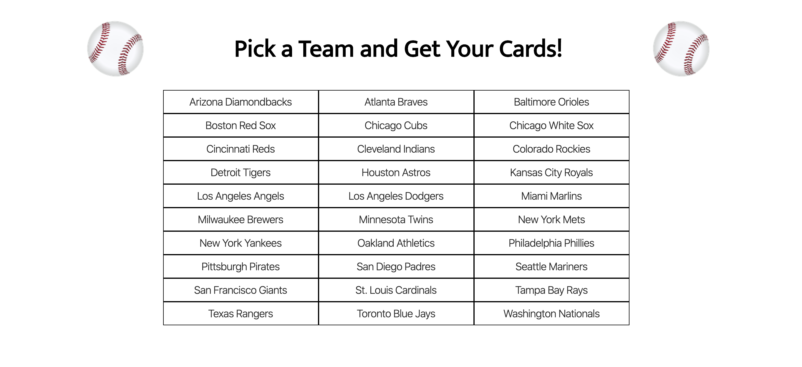
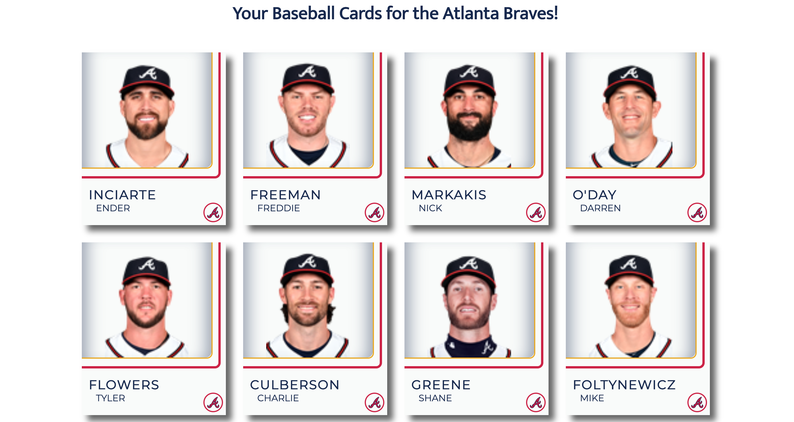
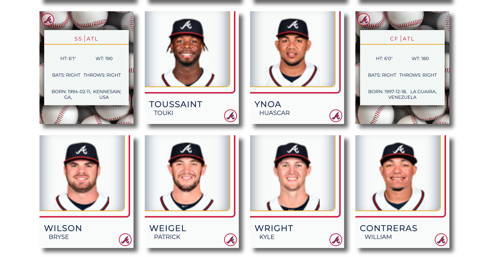

# Cartophiles

> Browse MLB rosters and flip styled baseball cards for active players—built as a Vue 3 single-page app.

## Overview

Cartophiles loads all Major League Baseball teams, lets you pick one, and renders a roster as collectible-style cards. Player details on the card back come from the same public stats feed the app uses for teams and rosters. Team colors and logos follow real franchise styling; data is live from MLB’s API.

## Features

- Lists MLB teams and filters to the major-league sport only
- Fetches a team roster on demand and shows one card per player
- Card front/back UI with team-themed styling
- Axios client with a short-lived cache adapter for repeat requests
- Production build can call the MLB Stats API directly from the browser (CORS-friendly)
- Local development uses a small Express proxy so the SPA talks to same-origin URLs

## Installation

```bash
git clone https://github.com/danibsheehan/baseball-collection.git
cd baseball-collection
npm ci
```

Requires **Node.js 20** (matches the GitHub Actions workflow).

## Quick Start

**Development** — run the API proxy and the Vue dev server in two terminals:

```bash
# Terminal 1 — Express proxy on port 3000 (forwards to MLB Stats API)
npm run api

# Terminal 2 — Vite dev server (proxies /teams and /people to the proxy)
npm run dev
```

Open the URL printed by `npm run dev` (typically `http://localhost:5173`).

**Production-style static build** — point the client at the MLB API base (see `.env.production`), then build:

```bash
npm run build
```

**Build + bundle size** — same as `npm run build`, then a short table of `dist/assets` (raw and gzip-compressed sizes):

```bash
npm run build:report
```

## Performance profiling (quick checklist)

Use this when checking load time, network cost, or regressions after changes.

1. **Lighthouse (Chrome DevTools)** — *Lighthouse* panel: run *Performance* (mobile + desktop). Note LCP, TBT, and *Network dependency tree* for the critical path.
2. **Network** — Disable cache, hard reload, pick a team: confirm batched `GET /people?ids=…` (or production MLB URL) instead of dozens of single-people calls; check image requests (headshots) start only as cards approach the viewport.
3. **Coverage (optional)** — *More tools → Coverage*: record while using the app; see how much JS/CSS is used on first paint vs after interactions.
4. **Vue DevTools** — *Timeline* / component updates: flip cards and switch teams; ensure you are not seeing excessive re-renders on large lists.
5. **Repeat visits** — Second load with cache enabled: static assets should be `304` or from memory cache; API responses may hit `Cache-Control` from `server.js` when using the Express proxy.

**Serve the built app with Express** (static `dist` plus proxy routes):

```bash
npm start
```

## API reference

The browser calls these paths relative to the app origin. In development they hit the Vite dev server and are proxied to `server.js`; in production (e.g. GitHub Pages) `VITE_API_BASE` is set so requests go straight to MLB.

| Client path | Purpose |
|-------------|---------|
| `GET /teams` | MLB teams collection (app keeps `sport.name === 'Major League Baseball'`) |
| `GET /teams/:teamId/roster` | Active roster for one team |
| `GET /people/:playerId` | Player record for card back details |

Upstream data is from the **MLB Stats API** (`https://statsapi.mlb.com/api/v1/`). Response shapes follow that API.

## Configuration

| Option | Type | Default | Description |
|--------|------|---------|-------------|
| `VITE_API_BASE` | string | *(empty in dev)* | Full MLB Stats API root, e.g. `https://statsapi.mlb.com/api/v1`. When unset, the client uses `location.origin` and relies on the dev proxy or Express routes. |
| `VITE_PUBLIC_PATH` | string | `/` | Vite `base` URL; set to `/repository-name/` for GitHub project Pages. |
| `PORT` | number | `8080` | Port for `server.js` when using `npm start`. |
| `npm run api` | — | `3000` | Sets `PORT=3000` for the local proxy used with `npm run dev`. |

## Deployment

- **GitHub Pages**: workflow `.github/workflows/deploy-pages.yml` runs `npm ci`, `npm run build` with `VITE_API_BASE` and `VITE_PUBLIC_PATH`, then deploys `dist`.
- **Heroku**: `package.json` includes `heroku-postbuild` to install dev dependencies and build; use `npm start` as the web process if you deploy this repo as a Node app.

## Contributing

```bash
npm run lint
```

## Screenshots

  

## Attributions & disclaimer

Team colors and logo treatments draw on reference material from [U.S. Team Colors](https://usteamcolors.com/). Team names, colors, and logos belong to their respective owners; this project is not affiliated with MLB or any club.

## License

No `LICENSE` file is present in this repository; add one if you want a specific terms choice.
